<div align="center">

<!-- BANNER -->


<!-- ANIMATED BOT — upload bot.svg to your profile repo root and this will work -->


<!-- TYPING SVG -->
[](https://github.com/utkarshsingh-8)

<br/>

# Hi, I'm **Utkarsh Singh** 👋

### `AI Engineer` · Cellogen Therapeutics · Medical ML Systems

<br/>

[](https://utkarsh-portfolio-three.vercel.app)
[](https://github.com/utkarshsingh-8)
[](https://linkedin.com/in/utkarshsingh-8)
[](https://github.com/utkarshsingh-8)

<br/>


</div>

---

## `whoami`

```python
engineer = {
    "name"    : "Utkarsh Singh",
    "role"    : "AI Engineer @ Cellogen Therapeutics",
    "since"   : "March 2026",
    "focus"   : ["Medical AI", "RAG Systems", "LLM Fine-tuning", "Agentic Pipelines"],
    "prev"    : ["MindNerves Technologies — SmoochBox US", "SVAM International — US Event Platform"],
    "stack"   : ["Python", "PyTorch", "BioMistral 7B", "LangChain", "FastAPI", "AWS"],
    "loc"     : "India 🇮🇳",
}
```

I build production ML systems — retrieval pipelines with tracked eval metrics, fine-tuned biomedical LLMs, and backend services that handle live traffic. 1.5+ years of backend engineering on US products before moving full-time into AI.

---

## ⚡ Current Build

### CAR-T AI Agent Platform · Cellogen Therapeutics

> Multi-portal medical AI for CAR-T cell therapy research and clinical support.

| # | Layer | Component | Detail |
|---|-------|-----------|--------|
| 01 | Retrieval | `FAISS` dense index | Layer 1 — candidate fetch |
| 02 | Reranking | `BioMistral 7B` | Layer 2 — domain-aware rerank |
| 03 | Fallback | `Groq API` | Layer 3 — low-latency escape hatch |
| 04 | Training | LoRA fine-tune on CAR-T corpus | eval_loss `1.026 → 1.014` |
| 05 | Agent | `AutoResearch` | Autonomous hyperparameter search — no human loop |
| 06 | Eval | `Ragas` | Faithfulness + answer-relevancy gated per layer |

---

## 🛠 Featured Projects

<table>
<tr>
<td width="50%" valign="top">

### [Hybrid RAG Service](https://github.com/utkarshsingh-8)
`Python` · `FastAPI` · `LangChain` · `Pinecone` · `Ragas`

- BM25 + Pinecone dual-index, fused via reciprocal rank fusion
- Ragas eval suite gated in CI (faithfulness, context precision)
- Async FastAPI with per-request latency instrumentation
- Dockerized, AWS ECS deployable

</td>
<td width="50%" valign="top">

### [E-commerce Microservices](https://github.com/utkarshsingh-8)
`Node.js` · `RabbitMQ` · `PostgreSQL` · `Redis`

- RabbitMQ async bus: placed → confirmed → dispatched
- Redis-backed cart and session cache under concurrent load
- PostgreSQL with connection pooling
- Each service independently containerized

</td>
</tr>
</table>

---

## 🧠 Stack

<div align="center">

**ML / AI**

[](https://skillicons.dev)


**Backend & Infra**

[](https://skillicons.dev)

</div>

---

## 📊 GitHub Stats

<div align="center">


&nbsp;


</div>

---
